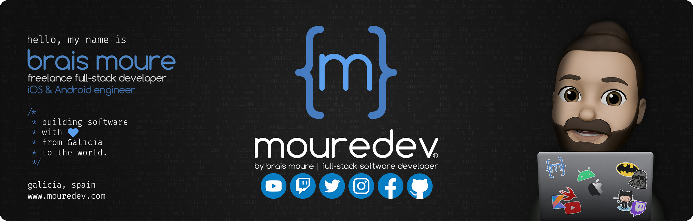

#  Hola, mi nombre es Brais Moure 👋
### Freelance full-stack iOS & Android engineer

Soy ingeniero de software profesional desde 2010.

He trabajado en distintas multinacionales del sector, creando [MoureDev](https://moure.dev) en 2015 para dedicarme a desarrollar aplicaciones móviles a tiempo completo, llegando a colaborar con empresas de distintas partes del mundo. He desarrollado más de 150 proyectos (alcanzando el número 1 en 30 países) y he creado mi propia startup.

Desde 2018 comienzo a crear contenido divulgativo sobre programación en redes sociales, compaginándolo con mi actividad como freelance. Nuestra comunidad de habla hispana sobre desarrollo de software es una de las más grandes a nivel mundial (con cerca de dos millones de seguidores entre las distintas redes). Mi objetivo es devolver todo el conocimiento que la comunidad ha compartido conmigo de forma gratuita a lo largo de los años, así como ayudar a que más personas puedan acceder a su estudio.

> 👥 [Microsoft MVP](https://mvp.microsoft.com/es-es/PublicProfile/5004970) (Most Valuable Professional) in Developer Technologies
> 
> ⭐️ [GitHub star](https://stars.github.com/profiles/mouredev/)

## Encuéntrame en:

 

 

 

# Únete al campus de programación de la comunidad

#### Te presento [mouredev pro](https://mouredev.pro), mi proyecto más importante para ayudarte a estudiar programación y desarrollo de software de manera diferente.

> **¿Buscas un extra?** Aquí encontrarás mis cursos editados por lecciones individuales, para avanzar a tu ritmo y guardar el progreso. También dispondrás de ejercicios y correcciones, test para validar tus conocimientos, examen y certificado público de finalización, soporte, foro de estudiantes, reunionnes grupales, cursos exclusivos y mucho más.
> 
> Entra en **[mouredev.pro](https://mouredev.pro)** y utiliza el cupón **"PRO"** con un 10% de descuento en tu primera suscripción.

# Algunos proyectos de la comunidad

## Ruta de estudio programación

## Python desde cero: Curso gratis

## JavaScript desde cero: Curso gratis

## Git & GitHub desde cero: Curso gratis

## Un día, un lenguaje: Primeros pasos en 11 lenguajes

## SQL y bases de datos: Curso gratis

## Algunos vídeos en YouTube:

<table style="width:100%">
<tr>
<td>

</td>
<td>

</td>
<td>

</td>
</tr>
<tr>
<td>

</td>
<td>

</td>
<td>

</td>
</tr>
<tr>
<td>

</td>
<td>

</td>
<td>

</td>
</tr>
</table>

## Contacto y apoyo:

[_Gracias!-orange?style=for-the-badge&logo=Microsoft+Outlook&logoColor=white&labelColor=101010)](https://mypublicinbox.com/mouredev)
 
[-D14836?style=for-the-badge&logo=gmail&logoColor=white&labelColor=101010)](mailto:braismoure@mouredev.com)
 
