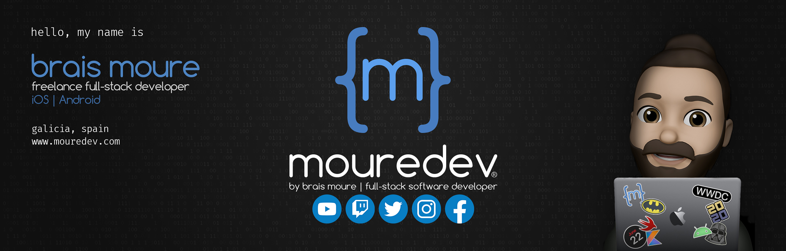

#  Hello, my name is Brais Moure
## Freelance full-stack iOS & Android engineer

I'm a professional software developer for more than ten years.

In 2014 I left my job at a multinational and create [**MoureDev**](https://mouredev.com), the reflection of my dream to grow as a professional within the software development industry.
Since then I have dedicated myself to specializing in mobile application development, collaborating with companies from different parts of the world, creating more than 60 Apps and founding my own startup.

In 2018 I return to my small hometown in Galicia (Spain), and I begin to create programming content and share my experience as a developer on platforms such as YouTube, Udemy and Twitch. I want to return all the knowledge that the community has shared with me for free.

## Find me at:
* ▶️ [YouTube](https://youtube.com/mouredevapps): iOS and Android app programming tutorials
* 🕹 [Twitch](https://twitch.tv/mouredev): Livecoding & more
* 🖥 [MoureDev.com](https://mouredev.com): My personal site
* 🐦 [Twitter](https://twitter.com/mouredev) 📷 [Instagram](https://instagram.com/mouredev) 📝 [Facebook](https://facebook.com/mouredev)
* 🎓 [LinkedIn](https://www.linkedin.com/in/braismoure/)

## Contact me:
* ☕️ [MyPublicInbox.com](https://mypublicinbox.com/mouredev): Send me a message and invite me to a coffee
* 📩 [braismoure@mouredev.com](mailto:braismoure@mouredev.com)